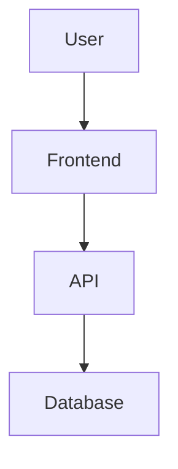

# Markdown Viewer

Windows desktop Markdown viewer and editor (with PDF reading) built with PyQt6.

## Markdown Support

CommonMark plus tables, strikethrough, task lists, footnotes, definition
lists, automatic links (bare URLs become clickable), and smart typography.
Code blocks are syntax-highlighted and get a one-click **copy** button on hover.

Task lists are interactive: ticking a `- [ ]` checkbox in the preview rewrites
the underlying Markdown (`- [ ]` ↔ `- [x]`) and saves it.

## Wiki-links And Backlinks

Link between notes with `[[Note]]` or `[[Note|display text]]`. Clicking a
wiki-link opens the target note (and offers to create it if it doesn't exist
yet). The sidebar **連結** tab shows the **backlinks** — every note that links
to the one you're reading. Links resolve across your registered libraries and
the current folder.

```markdown
See [[Project Plan]] and [[Meeting Notes|last week's notes]].
```

## Math

Inline `$...$` and block `$$...$$` LaTeX math render offline via a bundled
[KaTeX](https://katex.org/) — no network required.

````markdown
Inline $E = mc^2$ and a block:

$$
\int_0^1 x^2 \, dx = \tfrac{1}{3}
$$
````

## Editing

Click the pencil (or press **Ctrl+E**) to edit. Edit mode is a split view: a
syntax-highlighted Markdown editor on the left and a **live preview** on the
right that updates as you type and scrolls in sync. **Ctrl+S** saves, and
**Ctrl+F** opens find & replace within the editor.

Saves are crash-safe: the file is written atomically and the previous version
is kept as a `.bak`. If another program changes the open file (e.g. a cloud
sync), the app notices and offers to reload.

## PDF Reading

Open a PDF to read it in a native viewer:

- The sidebar **目錄** (TOC) tab shows the PDF outline — click to jump.
- **Ctrl+F** searches the PDF text in-app (Enter / Shift+Enter to step results).
- The app remembers the last page you read and returns there next time.
- The **標註** tab holds page-anchored notes: add a note to the page you're on,
  tag it, and click it later to jump back. Notes are saved in a sidecar
  (`<document>.pdf.notes.json`) next to the PDF.

> Note: PDF notes are page-level. Pixel-precise text highlighting isn't offered
> because Qt's PDF viewer exposes no text-selection geometry to anchor a
> highlight to.

## Keyboard Shortcuts

| Shortcut | Action |
| --- | --- |
| Ctrl+O | Open a document |
| Ctrl+P | Quick open (fuzzy file finder) |
| Ctrl+F | Find in document / PDF |
| Ctrl+E | Toggle edit mode |
| Ctrl+S | Save |
| Ctrl+Shift+P | Export to PDF |
| Ctrl+= / Ctrl+- / Ctrl+0 | Zoom in / out / reset |

## Images And Diagrams

Standard Markdown images render directly — local (relative or absolute) and remote URLs are all supported. Large images scale to fit the content width automatically.

```markdown


```

Diagrams can be written inline with [Mermaid](https://mermaid.js.org/) fenced code blocks and are rendered live (bundled offline — no network required):

````markdown

````

Mermaid diagrams re-color automatically when you switch between light and dark themes.

## Annotations

Select text in the preview to highlight it (pick a color from the popup), then
use the **標註** tab to add a note or tags, change the color, or delete it. Tag a
whole file in the same tab, and filter the **最近** list by tag to find files.

Annotations are saved in a sidecar file named `<document>.md.notes.json` next to
the Markdown file. They never modify your Markdown source. If you move or rename
the Markdown file, move the `.notes.json` with it to keep the annotations.

## Development

```powershell
py -3 -m pip install -r requirements.txt
py -3 main.py
```

## Build Installer

Install build tools first:

```powershell
py -3 -m pip install pyinstaller Pillow
```

Build the icon, executable, and installer:

```powershell
py -3 tools/build_icon.py
py -3 -m PyInstaller markdown_viewer.spec
& "C:\Program Files (x86)\Inno Setup 6\ISCC.exe" installer.iss
```

The installer is written to `installer_output/`.

## Release And Auto Update

The application checks GitHub Releases for updates. A release must include an installer asset named like `MarkdownViewer_Setup_v1.2.0.exe`.

To publish a new version:

```powershell
py -3 tools/bump_version.py 1.2.1
git add .
git commit -m "Release v1.2.1"
git tag v1.2.1
git push
git push origin v1.2.1
```

The GitHub Actions release workflow builds the Windows installer and uploads it to the GitHub Release. Installed users can then use `Help > Check for Updates`.
