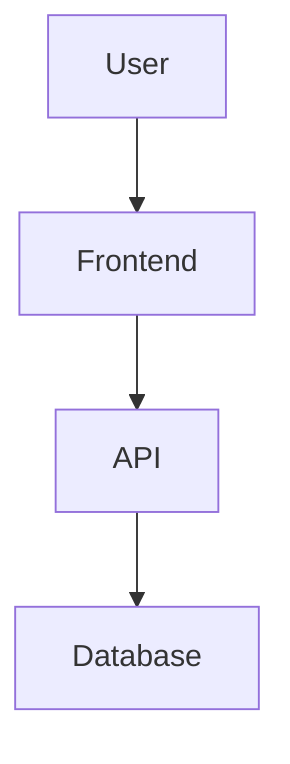

# Markdown Viewer

Windows desktop Markdown viewer built with PyQt6.

## Images And Diagrams

Standard Markdown images render directly — local (relative or absolute) and remote URLs are all supported. Large images scale to fit the content width automatically.

```markdown


```

Diagrams can be written inline with [Mermaid](https://mermaid.js.org/) fenced code blocks and are rendered live (bundled offline — no network required):

````markdown

````

Mermaid diagrams re-color automatically when you switch between light and dark themes.

## Annotations

Select text in the preview to highlight it (pick a color from the popup), then
use the **標註** tab to add a note or tags, change the color, or delete it. Tag a
whole file in the same tab, and filter the **最近** list by tag to find files.

Annotations are saved in a sidecar file named `<document>.md.notes.json` next to
the Markdown file. They never modify your Markdown source. If you move or rename
the Markdown file, move the `.notes.json` with it to keep the annotations.

## Development

```powershell
py -3 -m pip install -r requirements.txt
py -3 main.py
```

## Build Installer

Install build tools first:

```powershell
py -3 -m pip install pyinstaller Pillow
```

Build the icon, executable, and installer:

```powershell
py -3 tools/build_icon.py
py -3 -m PyInstaller markdown_viewer.spec
& "C:\Program Files (x86)\Inno Setup 6\ISCC.exe" installer.iss
```

The installer is written to `installer_output/`.

## Release And Auto Update

The application checks GitHub Releases for updates. A release must include an installer asset named like `MarkdownViewer_Setup_v1.2.0.exe`.

To publish a new version:

```powershell
py -3 tools/bump_version.py 1.2.1
git add .
git commit -m "Release v1.2.1"
git tag v1.2.1
git push
git push origin v1.2.1
```

The GitHub Actions release workflow builds the Windows installer and uploads it to the GitHub Release. Installed users can then use `Help > Check for Updates`.
