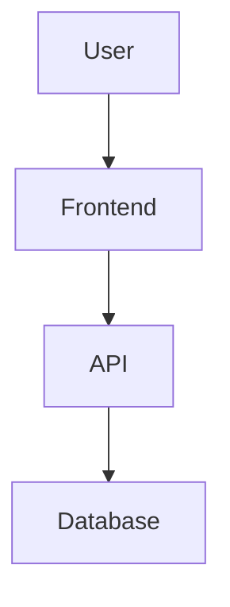

# Markdown Viewer

Windows desktop Markdown viewer and editor (with PDF reading) built with PyQt6.

## Markdown Support

CommonMark plus tables, strikethrough, task lists, footnotes, definition
lists, automatic links (bare URLs become clickable), and smart typography.
Code blocks are syntax-highlighted and get a one-click **copy** button on hover.

Task lists are interactive: ticking a `- [ ]` checkbox in the preview rewrites
the underlying Markdown (`- [ ]` ↔ `- [x]`) and saves it.

Obsidian-style callouts are supported, and a small allowlist of safe inline
HTML (`<kbd>`, `<mark>`, `<sub>`, `<sup>`, `<ins>`, `<del>`, `<abbr>`) plus
`<details>`/`<summary>` passes through — everything else stays escaped.

```markdown
> [!warning] Heads up
> This renders as a coloured callout box.
```

YAML front matter is shown as a metadata block at the top of the document, and
its `tags:` feed the **標籤** (tags) sidebar tab, where you can click a tag to
filter your files.

## Wiki-links And Backlinks

Link between notes with `[[Note]]` or `[[Note|display text]]`. Clicking a
wiki-link opens the target note (and offers to create it if it doesn't exist
yet). The sidebar **連結** tab shows the **backlinks** — every note that links
to the one you're reading. Links resolve across your registered libraries and
the current folder.

```markdown
See [[Project Plan]] and [[Meeting Notes|last week's notes]].
```

## Math

Inline `$...$` and block `$$...$$` LaTeX math render offline via a bundled
[KaTeX](https://katex.org/) — no network required.

````markdown
Inline $E = mc^2$ and a block:

$$
\int_0^1 x^2 \, dx = \tfrac{1}{3}
$$
````

## Editing

Click the pencil (or press **Ctrl+E**) to edit. Edit mode is a split view: a
syntax-highlighted Markdown editor on the left and a **live preview** on the
right that updates as you type and scrolls in sync. **Ctrl+S** saves, and
**Ctrl+F** opens find & replace within the editor.

Saves are crash-safe: the file is written atomically and the previous version
is kept as a `.bak`. If another program changes the open file (e.g. a cloud
sync), the app notices and offers to reload.

## PDF Reading

Open a PDF to read it in a native viewer:

- The sidebar **目錄** (TOC) tab shows the PDF outline — click to jump.
- **Ctrl+F** searches the PDF text in-app (Enter / Shift+Enter to step results).
- The app remembers the last page you read and returns there next time.
- **Password-protected PDFs** prompt for the open password when you load them;
  enter it to unlock reading, search, and the outline (a wrong password re-prompts).
- **Select text** by dragging across it, then **Ctrl+C** to copy, or right-click
  for **複製 / 螢光標記** (copy / highlight in a chosen color).
- The **螢光筆** toolbar button toggles highlighter mode: with it on, simply drag
  across text to highlight it in the current color (or press **H** on a
  selection).
- The **標註** tab has two sub-tabs: **螢光** lists your text highlights (jump,
  recolor, attach a note, or delete each one) and **頁註** holds page-anchored
  notes. Highlights save to `<document>.pdf.highlights.json` and notes to
  `<document>.pdf.notes.json`, both sidecars next to the PDF.

PDFs are rendered by Qt's built-in engine (PDFium) — **no Adobe Reader or other
external software is required**.

## Keyboard Shortcuts

| Shortcut | Action |
| --- | --- |
| Ctrl+O | Open a document |
| Ctrl+P | Quick open (fuzzy file finder) |
| Ctrl+F | Find in document / PDF |
| Ctrl+E | Toggle edit mode |
| Ctrl+S | Save |
| Ctrl+Shift+P | Export to PDF |
| Ctrl+Shift+M | Open Mermaid workspace |
| Ctrl+Tab / Ctrl+Shift+Tab | Switch to next / previous tab |
| Ctrl+W | Close the current tab |
| Ctrl+C | Copy selected PDF text |
| H | Highlight the current PDF selection |
| Ctrl+= / Ctrl+- / Ctrl+0 | Zoom in / out / reset |

Open several documents at once as **tabs** — switch with Ctrl+Tab / Ctrl+Shift+Tab,
close with Ctrl+W, drag to reorder, and your open tabs are restored on the next
launch. The full list is also available in-app via **Help → 鍵盤快捷鍵**.

A menu bar (File / Edit / View / Tools / Help) exposes these actions, and
**Tools → 偏好設定** (Preferences) lets you set the default zoom, a custom CSS
file for the rendered content, and whether to check for updates on startup.

## Export

A Markdown document can be exported to **PDF** (Ctrl+Shift+P) or to an editable
**PowerPoint deck** (File → 匯出 PPT). The deck is split into slides by `---`
thematic breaks if the document has any, otherwise by the `##` heading level, and
headings, bullet lists, code blocks, tables and images become native (editable)
PowerPoint objects — no Office or LibreOffice install required. Mermaid diagrams
and `$$` math are rendered to images and embedded (a fragment that can't be
rendered falls back to a labelled source box).

## Images And Diagrams

Standard Markdown images render directly — local (relative or absolute) and remote URLs are all supported. Large images scale to fit the content width automatically.

```markdown


```

Diagrams can be written inline with [Mermaid](https://mermaid.js.org/) fenced code blocks and are rendered live (bundled offline — no network required):

````markdown

````

Mermaid diagrams re-color automatically when you switch between light and dark themes.

### Mermaid Workspace

Press **Ctrl+Shift+M** or use **Tools > Mermaid Workspace** to open a dedicated
diagram workspace. It has templates, snippets, a live preview, Mermaid error
feedback, preview theme selection, source formatting, copy Mermaid, copy/export
SVG, and copy/export PNG.

For `flowchart TD` / `flowchart LR` diagrams, the workspace also has a
**Visual** tab. Use it to add Start, Process, Decision, and End nodes, drag
nodes around, connect nodes, edit selected node/edge details in the properties
panel, auto-layout the graph, collapse the final Mermaid preview, and let the app
regenerate Mermaid source automatically. Visual node positions are saved in
Mermaid comments that Mermaid ignores, so fenced blocks remain portable while the
editor can restore the layout. Supported flowcharts sync both ways: editing
source updates the visual canvas, and visual edits update source. More complex
Mermaid syntax stays source-only, with an option to create a simplified visual
copy without overwriting the original block until you confirm the update.

For `gantt` diagrams, the **Visual** tab switches to a Gantt task editor. You can
edit the title, date format, sections, task names, task IDs, status, start
rules, and durations, and the workspace regenerates Mermaid Gantt source.

For `sequenceDiagram`, `classDiagram`, `stateDiagram-v2`, and `erDiagram`
templates, the **Visual** tab switches to a structured table editor with row
creation, deletion, ordering, and a properties panel. Source edits update the
structured editor, and structured edits regenerate the Mermaid source.

When editing a Markdown file, use **Tools > Edit Mermaid Diagram** to pick an
existing fenced Mermaid block, edit it in the workspace, and write it back to
the source. **Tools > Insert Mermaid Diagram** inserts a new fenced block at the
editor cursor.

## Annotations

Select text in the preview to highlight it (pick a color from the popup), then
use the **標註** tab to add a note or tags, change the color, or delete it. Tag a
whole file in the same tab, and filter the **最近** list by tag to find files.

Annotations are saved in a sidecar file named `<document>.md.notes.json` next to
the Markdown file. They never modify your Markdown source. If you move or rename
the Markdown file, move the `.notes.json` with it to keep the annotations.

## Development

```powershell
py -3 -m pip install -r requirements.txt
py -3 main.py
```

## Build Installer

Install build tools first:

```powershell
py -3 -m pip install pyinstaller Pillow
```

Build the icon, executable, and installer:

```powershell
py -3 tools/build_icon.py
py -3 -m PyInstaller markdown_viewer.spec
& "C:\Program Files (x86)\Inno Setup 6\ISCC.exe" installer.iss
```

The installer is written to `installer_output/`.

## Release And Auto Update

The application checks GitHub Releases for updates. A release must include an installer asset named like `MarkdownViewer_Setup_v1.2.0.exe`.

To publish a new version:

```powershell
py -3 tools/bump_version.py 1.2.1
git add .
git commit -m "Release v1.2.1"
git tag v1.2.1
git push
git push origin v1.2.1
```

The GitHub Actions release workflow builds the Windows installer and uploads it to the GitHub Release. Installed users can then use `Help > Check for Updates`.
