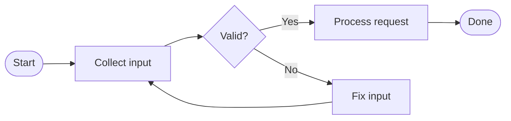

# Visual Flowchart Builder Design

Date: 2026-07-01
Status: Draft for user review

## Context

Markdown Viewer now has a Mermaid workspace with source editing, templates,
snippets, live preview, copy/export SVG and PNG, and Markdown fenced-block
integration. The current workflow still requires the user to write Mermaid
syntax.

The next product step is a visual flowchart builder: users should be able to
draw common flowcharts by dragging nodes and connecting them, while the app
keeps standard Mermaid source as the saved format.

## Goal

Add a dual-mode Mermaid Flowchart Builder:

- **Source mode** remains the current Mermaid text editor.
- **Visual mode** lets users drag nodes, connect them, edit labels, and delete
  graph items.
- Source and Visual mode synchronize both ways for a safe Mermaid `flowchart`
  subset.
- The saved Markdown remains normal Mermaid fenced code, so files stay portable.

## Non-Goals

- A full draw.io replacement.
- Visual editing for Mermaid sequence, class, state, ER, Gantt, mindmap, or
  other non-flowchart diagrams in the first version.
- Freeform shapes, image icons, swimlanes, groups, rich styling, custom colors,
  or advanced alignment tools in the first version.
- Lossy conversion of unsupported Mermaid syntax.

## Supported Mermaid Subset

The first version supports `flowchart TD` and `flowchart LR` with simple node
and edge statements:

Supported node shapes:

- Start/end: `A([Label])`
- Process: `A[Label]`
- Decision: `A{Label}`

Supported edges:

- Unlabeled: `A --> B`
- Labeled: `A -- Yes --> B`

Unsupported source-only features:

- `subgraph`
- `classDef`
- `style`
- `click`
- Mermaid init directives
- multiple statements on one line
- complex edge operators beyond `-->`
- HTML labels or deeply escaped labels
- other Mermaid diagram types

When unsupported syntax is detected, Visual mode shows a source-only message
and does not rewrite the source.

## Architecture Overview

Add three focused modules and keep `app/mermaid_workspace.py` as the coordinator.

| Module | Responsibility |
| --- | --- |
| `app/flowchart_model.py` | Pure Python graph model: nodes, edges, direction, selection-safe ids. |
| `app/flowchart_mermaid.py` | Parse supported Mermaid flowcharts into the graph model and render the graph model back to Mermaid source. |
| `app/flowchart_canvas.py` | Qt visual editor using `QGraphicsView` / `QGraphicsScene`. |

Existing modules:

- `app/mermaid_workspace.py` adds Source / Visual tabs and coordinates sync.
- `app/mermaid_render.py` keeps rendering the final Mermaid preview.
- `app/mermaid_blocks.py` keeps Markdown fenced-block integration.

## Data Model

`FlowchartGraph`:

- `direction`: `"TD"` or `"LR"`
- `nodes`: ordered list of `FlowNode`
- `edges`: ordered list of `FlowEdge`

`FlowNode`:

- `id`: Mermaid-safe id such as `N1`, `N2`
- `label`: displayed text
- `shape`: `"start"`, `"process"`, `"decision"`, or `"end"`
- `x`, `y`: canvas position for Visual mode only

`FlowEdge`:

- `id`: generated stable edge id
- `source`: source node id
- `target`: target node id
- `label`: optional edge text such as `Yes` or `No`

Canvas positions are not emitted into Mermaid source. Mermaid remains portable
and Mermaid's renderer is still responsible for final layout. Visual mode uses
positions only to make dragging/editing comfortable.

## Source-to-Visual Sync

When the source editor changes:

1. Debounce the change.
2. Try `parse_flowchart(source)`.
3. If parsing succeeds, update the graph model and canvas.
4. If parsing fails because the syntax is unsupported, keep source intact and
   show Visual mode as unavailable for that source.
5. Always update the Mermaid preview from the source.

The parser must be conservative. It should reject unsupported syntax instead of
guessing and producing a graph that would rewrite the source incorrectly.

## Visual-to-Source Sync

When the user edits the visual canvas:

1. Canvas emits `graph_changed`.
2. Workspace renders the graph model with `render_flowchart(graph)`.
3. Source editor text is replaced with the rendered Mermaid source.
4. Mermaid preview updates.

The workspace uses a `_syncing` flag so source changes and canvas changes do not
cause recursive update loops.

## Visual Mode UX

The Mermaid workspace gains a Source / Visual switch, preferably a `QTabWidget`
or segmented control above the editor area.

Visual mode layout:

- Left or top tool strip:
  - Add Start
  - Add Process
  - Add Decision
  - Add End
  - Connect mode
  - Delete selected
  - Direction selector: TD / LR
- Main canvas:
  - Drag nodes to move them.
  - Double-click a node to edit its label.
  - In connect mode, click source node then target node to create an edge.
  - Double-click an edge to edit its label.
  - Select node or edge and press Delete to remove it.
- Bottom status:
  - Shows whether Visual mode is synced, source-only, or has validation errors.

The right-side Mermaid preview remains visible so users can see the exact final
Mermaid rendering, not only the editable canvas representation.

## Unsupported Source Handling

If the source is unsupported:

- Visual mode stays available as a tab but displays an explanatory message.
- Source remains unchanged.
- Mermaid preview continues to render using the existing source renderer.
- The user can switch back to Source mode and continue editing.
- A "Create visual copy" action may be added later, but is not required for the
  first version.

## Error Handling

- Parser error: show a clear message in Visual mode and keep source intact.
- Duplicate node ids: either parse as unsupported or normalize only if it is
  provably safe. First version should reject duplicates.
- Edge references missing node ids: parse as unsupported.
- Empty source: Visual mode starts with a small default graph.
- Deleting a node: remove connected edges too.
- Direction changes: update graph direction and regenerate Mermaid source.

## Testing

Pure Python tests:

- Parse supported `flowchart TD` and `flowchart LR`.
- Parse process, decision, start/end node shapes.
- Parse unlabeled and labeled edges.
- Render graph back to stable Mermaid source.
- Round-trip parse/render/parse for supported graphs.
- Reject unsupported syntax without rewriting source.
- Preserve node labels containing safe punctuation.

Qt tests where practical:

- Canvas constructs.
- Setting a graph creates node and edge items.
- Moving a node updates its model position.
- Adding and deleting nodes/edges emits `graph_changed`.

Manual verification:

- Open Mermaid workspace.
- Switch between Source and Visual.
- Edit simple flowchart source and see Visual update.
- Drag nodes and see source/preview update.
- Add nodes and edges in Visual mode.
- Edit node and edge labels.
- Delete selected node/edge.
- Try unsupported Mermaid source and confirm it remains source-only.
- Edit a Mermaid fenced block from Markdown and save the visually edited graph
  back to the fenced block.

## Rollout Plan

1. Add pure graph model and parser/renderer with tests.
2. Add `QGraphicsView` canvas with basic nodes and edges.
3. Wire Source -> Visual sync.
4. Wire Visual -> Source sync.
5. Add visual controls and unsupported-source states.
6. Update README.

## Acceptance Criteria

- A user can create a flowchart without typing Mermaid syntax.
- A user can edit a supported `flowchart TD/LR` source and see the canvas update.
- A user can drag nodes, add nodes, connect nodes, edit labels, and delete graph
  items.
- Visual changes regenerate clean Mermaid source.
- Unsupported Mermaid source is never rewritten or damaged.
- Existing Mermaid preview, copy/export, and Markdown fenced-block integration
  continue to work.
